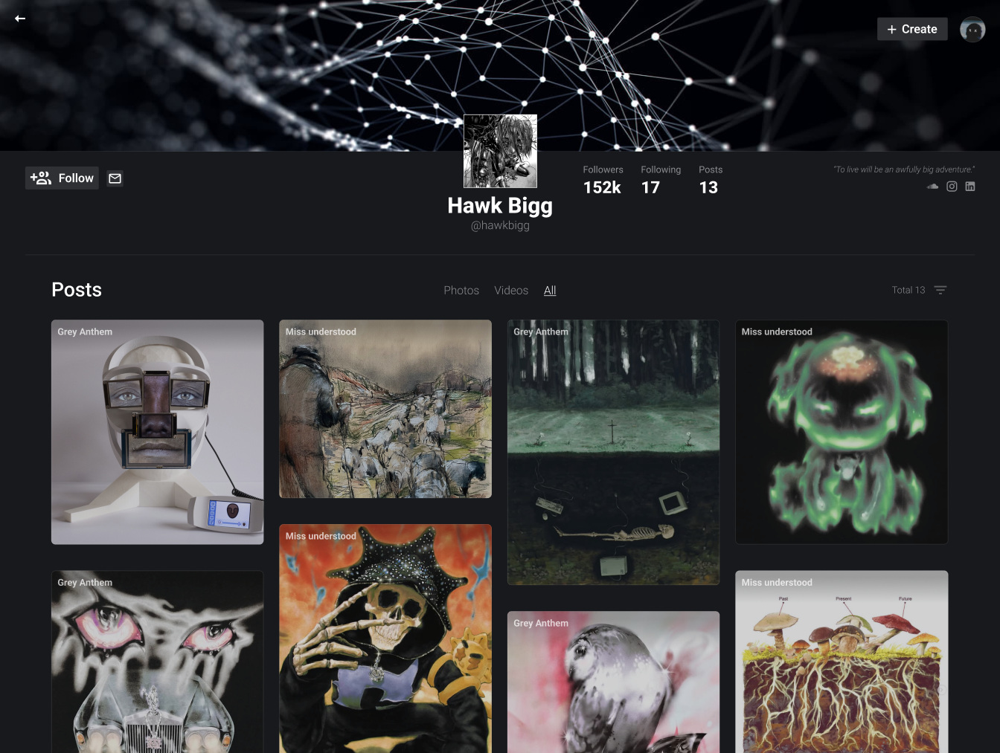

# Visihaus

## Overview
Visihaus is a modern platform that allows artists to showcase their work and connect with others. Users can create profiles, upload images and videos, and engage with the community through likes and sharing.

## 🚀 Features
🔹 **User Profiles** – Artists can register and manage their own portfolios.

🔹 **Media Upload** – Support for images and videos (future support for 3D models).

🔹 **Content Discovery** – Trending and tag-based filtering.

🔹 **Engagement** – Like and share artworks within the platform.

🔹 **Secure Authentication** – JWT-based user authentication.

🔹 **User & Moderator Panels** – Artists manage their content, and moderators (future feature) oversee the platform.

## 🛠️ Tech Stack
### **Frontend**  
- Vue.js  
- Tailwind CSS  

### **Backend**  
- Express.js  
- Prisma ORM  
- PostgreSQL  

### **Cloud & Deployment**  
- AWS EC2 (for hosting)
- AWS S3 (for cloud storage)  
- CI/CD for automated deployments
